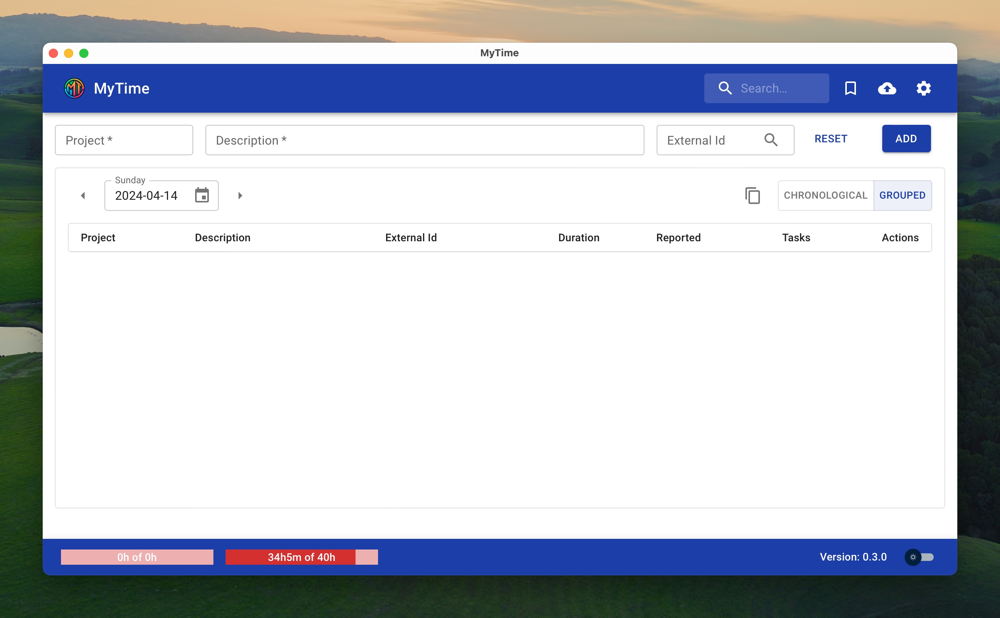
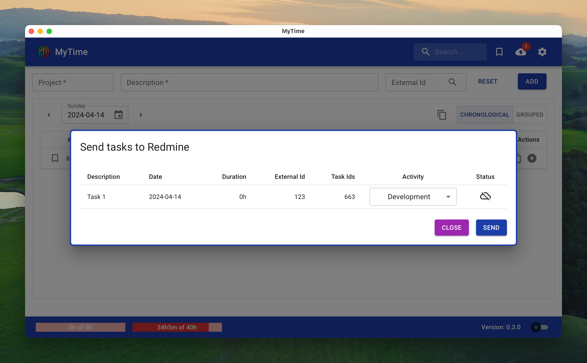

# mytime

<p align="center">
  
</p>

MyTime is an application to track your working time. It allows you register your daily tasks, calculate its duration
and synchronize with your ticketing system. At them moment is only integrated with Redmine and Jira.

Initial screen:


App with running tasks:


Synchronize your tasks:


## Database

It uses *sqlite3* to manage the database. It's stored at:

* Linux & Mac: `$HOME/.local/share/mytime/mytime.sqlite`
* Windows: `C:\Users\%USERNAME%\AppData\Local\mytime\mytime.sqlite`

## Development

Checkout repository. Main branch is called "main".

Run dev environment:

```
cd mytime-gui
npm install
npm run tauri dev
```

Build:

```
npm run tauri build
```

## Integrations, get tokens

### Redmine

* Go to your account ("https://<your-domain>/my/account")
* The API access key is in the right sidebar


### Jira

* Go to the tokens generator [page](https://id.atlassian.com/manage-profile/security/api-tokens)
* Use them in the config.
* The username is your email
