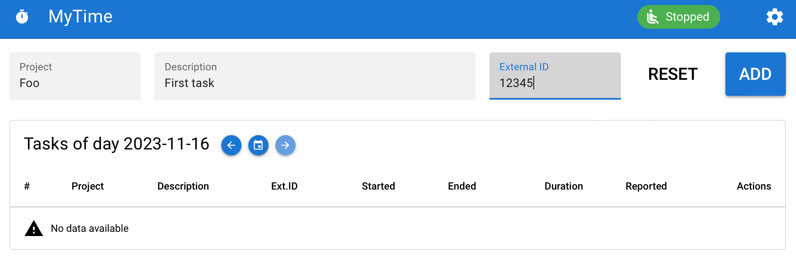
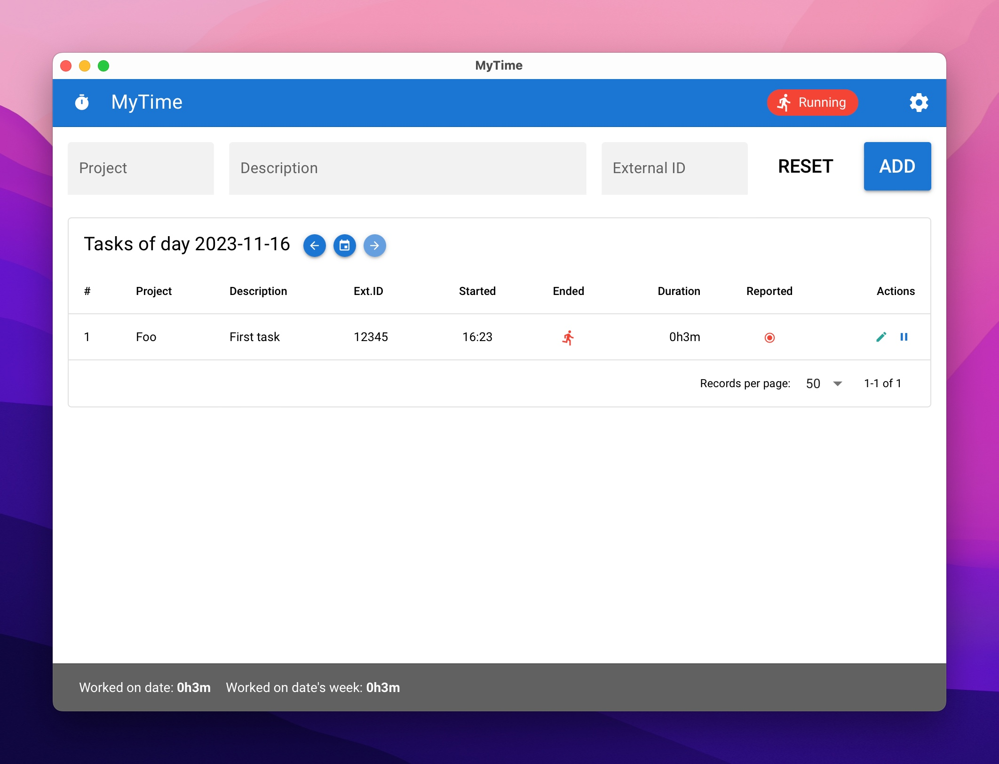

# mytime


MyTime is an application to track your working time. It allows you register your daily tasks, calculate its duration
and synchronize with your ticketing system. At them moment is only integrated with Redmine.

Create tasks:


See running and tasks done:


Synchronize your tasks:


## Database

It uses *sqlite3* to manage the database. It's stored at:

* Linux & Mac: `$HOME/.local/share/mytime/mytime.db`
* Windows: `C:\Users\%USERNAME%\AppData\Local\mytime\mytime.db`

## Development

Checkout repository. Main branch is called "main".

Run dev environment:

```
cd mytime-gui
npm install
npm run tauri dev
```

Build:

```
npm run tauri build
```
